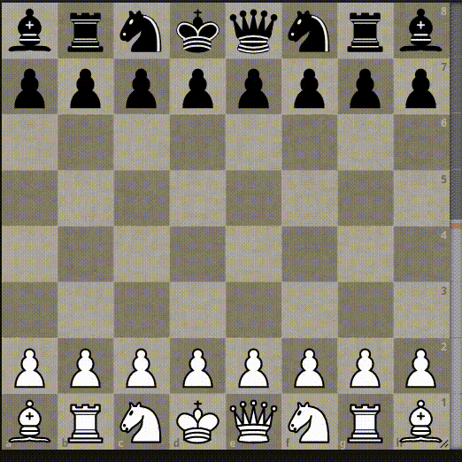

# ChessPieceSwitcher

A browser extension for switching around the piece sprites on Lichess and
Chess.com. Note that the game isn't effected, only the sprites that you see on
your end. Why? That's a very good question...

I am not responsible for any ELO losses or brain aneurysms that you may
experience as a result of using this extension.

This extensions is licensed under the GNU AGPL v3.

## Installation

This add-on is available to download for [Firefox](https://addons.mozilla.org/en-US/firefox/addon/chesspieceswitcher/).

It's currently awaiting approval in for Chrome and must be installed manually.

## Manual Installation

The extension is compatible with both Firefox and Chrome.

First, click "code" above and download as a zip and unzip (or clone if you
already have git installed).

In Firefox, go to `about:debugging`, click "This Firefox", "Load Temporary
Add-On", and select any file in the unzipped directory.

In Chrome, go to `chrome://extensions`, click "Load unpacked" and select the
unzipped folder itself.

Voila!

## Packaging

Simply run `./package.sh`
