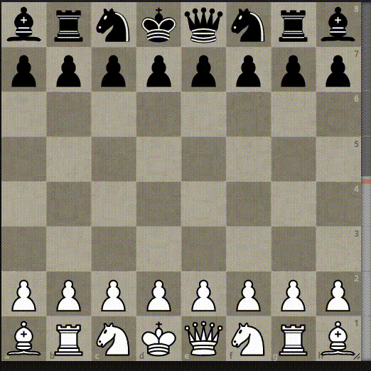

# LichessPieceSwitcher

A browser extension for switching up the pieces on Lichess. Note that the game
isn't effected, only the sprites that you see on your end. Why? That's a very
good question...

I am not responsible for any ELO losses or brain aneurysms that you may
experience as a result of using this extension.

This extensions is licensed under the GNU AGPL v3.

## Installation

The extension is compatible with both Firefox and Chrome.

First, click "code" above and download as a zip and unzip (or clone if you
already have git installed).

In Firefox, go to `about:debugging`, click "This Firefox", "Load Temporary
Add-On", and select any file in the unzipped directory.

<<<<<<< HEAD
In Chrome, go to `chrome://extensions`, click "Load unpacked" and select the
=======
In Chrome, go to `chrome://extensions`, click "Load unpacked" and selected he
>>>>>>> f591b3a9b63207dac71afa21a2c788a9cebbf804
unzipped folder itself.

Voila!

## Building

Simply run `web-ext build`
